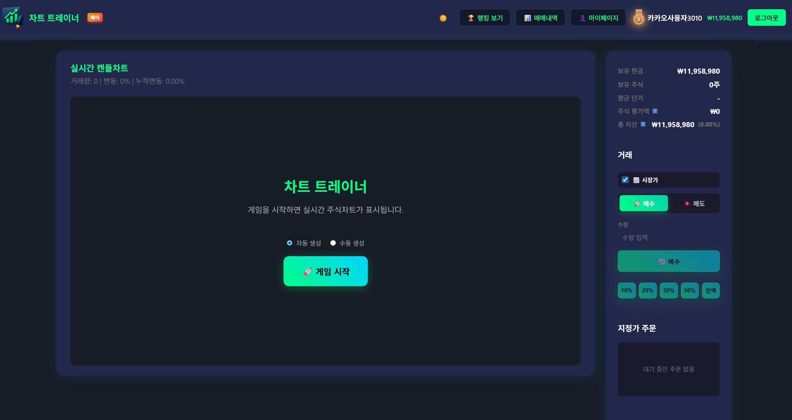
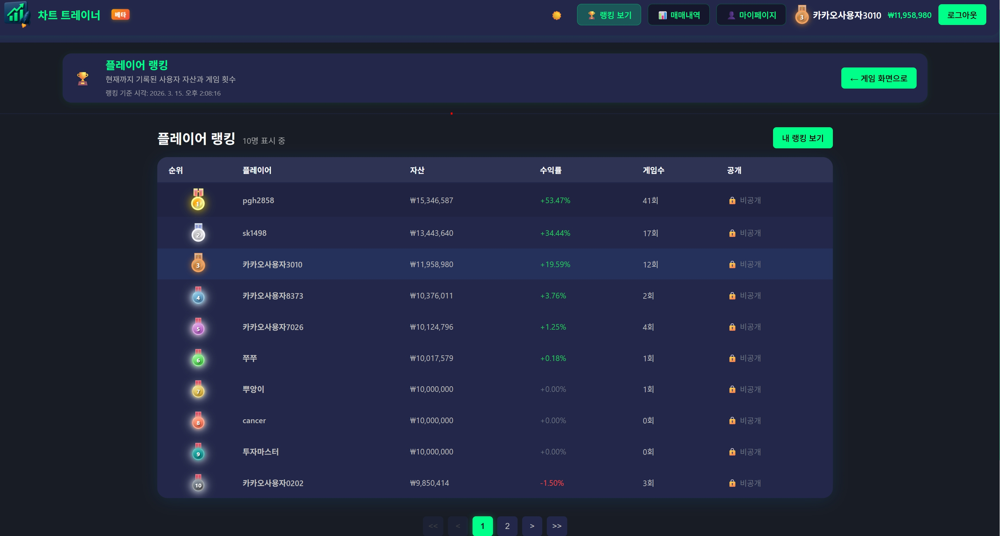
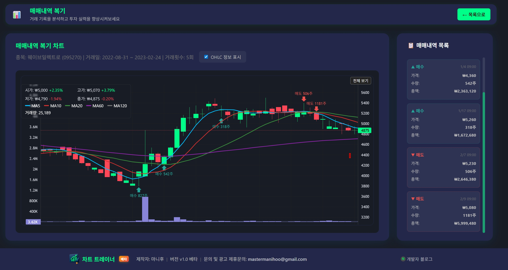
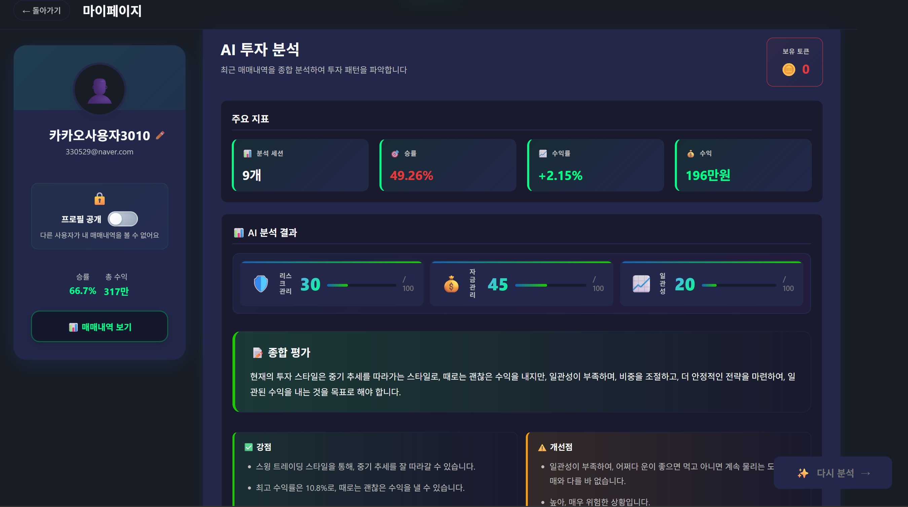
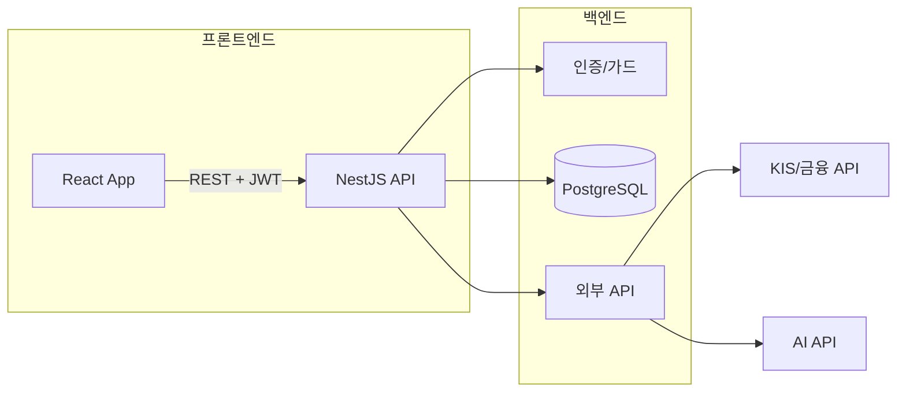
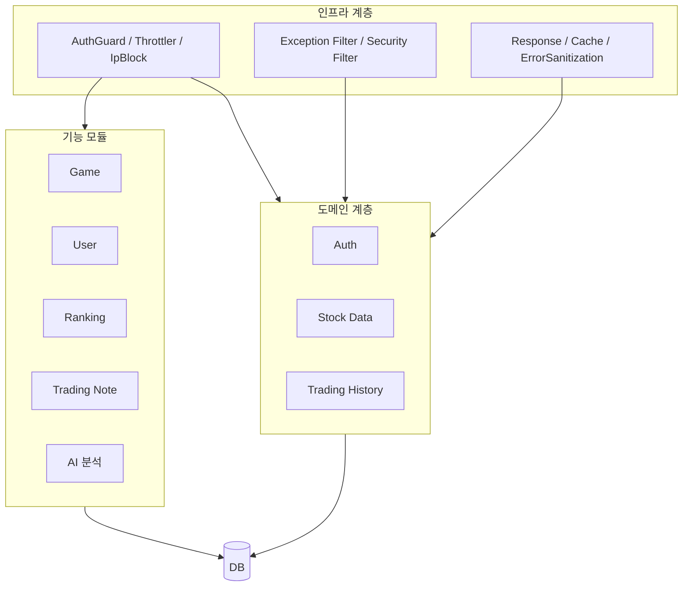

# 📈 차트트레이너 — 포트폴리오 개요

> **실제 유저가 사용 중인** 60초 실시간 차트 트레이딩 게임 서비스  
> (소스코드는 비공개 저장소로 운영 중이며, 본 문서는 포트폴리오용 요약입니다.)

---

## 📌 프로젝트 한 줄 소개

NestJS(백엔드)와 React(프론트엔드)로 구현한 **실시간 차트 트레이딩 게임**으로, 60초 동안 롱/숏 포지션을 취하며 수익을 극대화하는 것이 목표입니다. 회원가입·랭킹·매매 기록·마이페이지·AI 분석 등이 포함된 풀스택 서비스입니다.

---

## 👤 역할 및 기간

| 항목 | 내용 |
|------|------|
| **역할** | 풀스택 개발 (백엔드·프론트엔드 설계 및 구현) |
| **기간** | 2025.06~현재 (퇴근후 1시간씩 작업) |
| **운영** | 상용/개발 브랜치 분리 운영, 실제 유저 서비스 |
| **url** |https://charttrainer.manihoo.com/ (상용) https://dev-charttrainer.manihoo.com/ (개발)|

---

## 🖼️ 주요 화면 (캡처)

### 1. 랜딩 / 메인


서비스 첫 진입 시 보이는 랜딩·메인 화면입니다. Glassmorphism 스타일 UI와 메인 CTA 버튼으로 게임 진입을 유도합니다.

---

### 2. 게임 플레이 화면



게임 진입 후 메인 화면입니다. 실시간 차트와 함께 롱/숏 포지션 진입·종료 버튼, 잔고·포지션 상태를 한눈에 볼 수 있습니다.

---

### 3. 랭킹




순위표 화면입니다. 닉네임(필요 시 마스킹), 점수·수익률로 랭킹을 확인할 수 있습니다.


---

### 4. 마이페이지





마이페이지는 통계·업적·칭호, 매매 노트, AI 분석, 매매 내역을 대시보드 형태로 모아 둔 화면입니다. 위 캡처는 메인 요약, 거래 노트, AI 분석 화면입니다.

---


## 🏗️ 아키텍처 개요

### 시스템 구성도



### 백엔드 레이어 구조



### 프론트엔드 구조 (요약)

| 영역 | 설명 |
|------|------|
| **features/** | 게임, 매매 기록, 랭킹, 종목 데이터 등 기능 단위 |
| **components/** | 공통 UI, 게임 화면, 마이페이지, 랭킹 패널, 레이아웃 |
| **contexts/** | 인증(Auth) 전역 상태 |
| **services/** | API 호출 (auth, mypage, AI 분석 등) |
| **shared/** | 공통 타입·유틸 (계산, 포맷, 틱 사이즈 등) |

---

## 🚀 기술 스택

| 구분 | 기술 |
|------|------|
| **Backend** | NestJS, TypeScript, TypeORM, PostgreSQL |
| **Auth** | JWT (Access + Refresh), Passport, Kakao OAuth |
| **Frontend** | React, TypeScript, Lightweight Charts / Recharts |
| **API** | REST, Swagger/OpenAPI, 전역 ValidationPipe |
| **보안** | Helmet, CORS, Rate Limit(Throttler), IP 차단, 에러 시 텔레그램 알림 |
| **인프라** | 환경 변수(.env), PM2, Cloudflare Pages 등 (배포 환경에 따라 상이) |

---

## ✨ 기술적 하이라이트 (구현 포인트)

- **인증·보안**
  - JWT Access / Refresh 토큰 발급·갱신, 전역 AuthGuard 적용
  - Throttler 기반 Rate Limiting, IP 차단(잘못된 시도 제한)
  - SecurityExceptionFilter로 민감 에러 메시지 비노출, 크리티컬 에러 시 텔레그램 알림

- **백엔드 구조**
  - 도메인( auth / stock-data / trading-history )과 기능 모듈( game / user / trading-note 등 ) 분리
  - 전역 ResponseInterceptor로 응답 포맷 통일, 전역 Exception Filter로 에러 처리 일원화
  - BaseRepository 패턴으로 공통 CRUD·bulk insert/upsert 재사용
  - DTO + class-validator + Swagger ApiProperty로 요청 검증·API 문서화

- **운영·안정성**
  - Graceful Shutdown (SIGTERM/SIGINT 시 서버·DB 연결 정리)
  - DB 타임존 KST 설정, 시퀀스 재설정 등 기동 시 초기화
  - 프로덕션/개발 환경 분리 (로그·CORS·Swagger 노출 제어)

- **프론트엔드**
  - 공통 apiClient에서 401/402/403 처리, 토큰 자동 첨부, 인증 만료 이벤트 처리
  - AuthContext에서 리프레시 토큰 만료 전 갱신
  - 기능 단위(features) + 공통 컴포넌트 구조로 유지보수성 확보

---

## 🔧 주요 기능 요약

| 기능 | 설명 |
|------|------|
| **60초 트레이딩 게임** | 실시간 차트, 롱/숏 포지션 진입·종료, 제한 시간 내 수익 극대화 |
| **회원/인증** | 이메일 회원가입·로그인, 카카오 로그인, JWT 기반 인증 |
| **랭킹** | 점수/수익률 기반 순위, 페이지네이션 |
| **마이페이지** | 통계 차트, 업적·칭호·메달, 매매 요약 |
| **매매 기록** | 세션별·상세 내역, 차트와 연동, 거래 노트(메모) |
| **AI 분석** | (Groq 등 연동) 매매 구간 AI 분석 |

---

## 📁 프로젝트 구조 (개요)

```
프로젝트 루트
├── client/          # React 프론트엔드
│   └── src/
│       ├── components/   # 공통·페이지 컴포넌트
│       ├── features/    # 게임, 매매기록, 랭킹 등
│       ├── contexts/    # Auth 등 전역 상태
│       ├── services/    # API 호출
│       └── shared/      # 타입, 유틸
├── server/          # NestJS 백엔드
│   └── src/
│       ├── domain/      # auth, stock-data, trading-history
│       ├── modules/     # game, user, trading-note, groq 등
│       ├── infrastructure/  # 가드, 필터, 인터셉터
│       └── common/      # BaseRepository, DTO 등
└── shared/          # 클라이언트·서버 공통 타입
```

---

- **소스코드**: 실사용자가 사용중이라 보안상 비공개 저장소로 관리 중입니다.
- **실제 서비스**: 실제 유저가 사용 중인 상용/개발 환경이 있으며, 상용/개발 브랜치를 분리해 운영합니다.
- **프론트엔드**: 프론트엔드는 바이브코딩을 활용하여 개발하였습니다.

---

*본 문서는 포트폴리오용 요약이며, 실제 구현 상세는 비공개 저장소에서 관리됩니다.*
